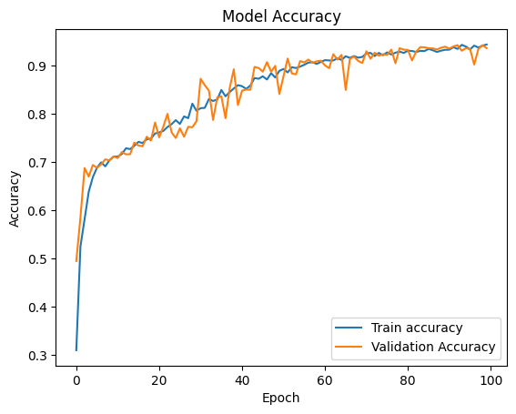

# Multilayer Perceptron <b>(MLP)</b>

It is a feedforward neural network used for classification and regression tasks. It consists of multiple layers of nodes or neurons, where each neuron is connected to the neurons in the previous and next layers.

## Working and details

### Working of MLP

1. Input data is fed into the input layer.
1. The input is transformed by passing through one or more hidden layers with nonlinear activation functions.
1. The output is produced by the output layer, which can be a single node for regression or multiple nodes for classification.
1. The model is trained using backpropagation, where the weights of the connections between the neurons are adjusted to minimize the error between the predicted and actual outputs.

### Pros of using MLP

- MLP can handle non-linear relationships between features and target variables.
- It can perform well on a wide range of datasets, even when the data is noisy or complex.
- MLP can be used for both classification and regression tasks.
- It can learn complex decision boundaries and capture interactions between features.

### Cons of using MLP

- MLP can be sensitive to the choice of activation function, number of hidden layers, and number of neurons in each layer, requiring careful tuning.
- It can be prone to overfitting if the model is too complex or the dataset is small.
- MLP can be computationally expensive and slow to train, especially when dealing with large datasets.
- It can be difficult to interpret the learned model and understand the contribution of individual features to the classification or regression.

## Results

### Accuracy Plot

### Loss Plot

### Confusion Matrix

### Classification Report

|              | precision | recall | f1-score | support |
| ------------ | --------- | ------ | -------- | ------- |
| 0            | 0.92      | 0.86   | 0.89     | 464     |
| 1            | 0.92      | 0.91   | 0.92     | 500     |
| 2            | 0.97      | 0.95   | 0.96     | 493     |
| 3            | 0.95      | 0.97   | 0.96     | 499     |
| 4            | 0.95      | 0.91   | 0.93     | 478     |
| 5            | 0.94      | 1.00   | 0.97     | 459     |
| 6            | 0.92      | 0.97   | 0.94     | 467     |
|              |           |        |          |         |
| accuracy     |           |        | 0.94     | 3360    |
| macro avg    | 0.94      | 0.94   | 0.94     | 3360    |
| weighted avg | 0.94      | 0.94   | 0.94     | 3360    |

### Code can be found [HERE](/main_1%20-%20MLP.ipynb)
